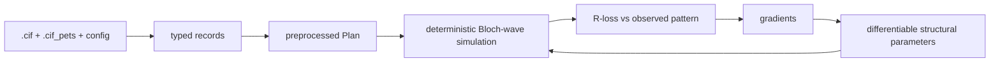

# diffBloch

Differentiable Bloch-wave electron-diffraction structure refinement.

The valuable core is a small **differentiable map from a handful of structural parameters to a
scalar R-loss**, minimised by gradient descent so that simulated and observed diffraction
intensities agree. Everything else — parsing, config, logging, orchestration — exists to make that
map inspectable, reproducible, and safe to evolve, and lives *around* the core, never inside it.

## Status

diffBloch starts with a deterministic Bloch-wave simulation, then exposes selected simulation
inputs as differentiable parameters. In PyTorch terms, those parameters sit inside an optimization
loop: each pass simulates diffraction from the current structure, compares the calculated beams with
an observed diffraction pattern, and uses gradients to improve the inputs so the simulation moves
towards the experiment. The differentiable parameters are structural quantities — primarily
asymmetric-unit (ASU) atom coordinates, with ADPs, occupancies, and structure factors available as
refinable groups.

The surrounding orchestration is deliberately a shell around that stable, physics-grounded
deterministic simulation. Its central layer is preprocessing, which produces a `Plan`: the immutable
geometry and data context the simulator will consume — shared structure-factor support, per-rotation
orientations, beam sets, rocking-curve tilts, observed patterns, alignments, and fitted nuisance
values such as thickness. The `Plan` is not the structure being refined; it is the settled scaffold
around the differentiable structural parameters that enter the optimization loop. Preprocessing is a
composable `Plan → Plan` pipeline: its steps select the solve beams, build per-orientation plans,
integrate rocking-curve tilts, apply mosaicity, fit orientation and thickness against
simulation/observation agreement, optionally sweep numerical coverage/convergence knobs, and settle
coupled beam unions for the final forward model. Because this settled `Plan` is expensive and
reusable, diffBloch checkpoints it as `plan.npz` plus a lock file, so later inference or refinement
runs can resume from the same validated preprocessing state instead of recomputing it. Config, IO,
logging, checkpointing, and the CLI wrap that pipeline so the workflow stays reproducible and
inspectable without becoming part of the scientific core.

diffBloch is driven by two input files: experimental diffraction data processed by
[PETS2](https://pets.fzu.cz/) into `.cif_pets`, and a starting crystal structure as a standard
`.cif`. Because the simulator makes concrete assumptions about the shapes, units, indices, and
crystallographic meaning in those files, diffBloch does not pass parser output directly into the
numerical core. It reads CIF/PETS data into typed [Pydantic](https://docs.pydantic.dev/) models
first, so invalid or unsupported input fails at the boundary with explicit validation errors.

| File | Role |
|---|---|
| `experiment.yaml` | Experiment config and references to the input files. |
| `structure.cif` | Starting crystal structure. |
| `observations.cif_pets` | Processed experimental diffraction observations. |
| `experiment.lock` | Content identity for the input CIF/PETS files. |
| `plan.npz` / `plan.lock` | Reusable preprocessing checkpoint and its provenance lock. |

To make refinements reproducible across the expensive preprocessing boundary, diffBloch records the
identity of the input CIFs and the preprocessing recipe. `experiment.lock` pins the structure and
observation files by content hash; `plan.lock` then ties a `plan.npz` checkpoint to that input lock,
the resolved preprocess-determining config, the ordered preprocess steps, the producing code
version, and the checkpoint artifact hash. This gives diffBloch-driven inference and refinement runs
a verifiable starting point: a reused checkpoint is known to match the inputs and preprocessing that
produced it, rather than being an unlabelled intermediate file.

As the pipeline runs, diffBloch emits typed observability events for preprocessing, coupling,
inference, and refinement progress. The default CLI prints those events through a console logger,
and the same event stream can be sent to CSV, Weights & Biases, or Comet; writing another logger is
just a matter of implementing the small logger protocol for the event objects you care about.



For day-to-day use, diffBloch ships with a CLI that has sane defaults for both preprocessing and the
refinement loop, and can be run out of the box against bundled compounds such as quartz,
abiraterone, LTA, and CsPbBr3. The examples choose `refinement.precision: fp32` for faster
iteration; switch that field to `fp64` for the conservative highest-precision refinement path.

```bash
diffbloch run refine examples/experiments/quartz-checkpoint
```

It also supports scientific research workflows for power users who need to compose their own
pipelines, constraints, penalties, or model components. To get started with those patterns, review
`examples/papers`, which shows more advanced usage than the default CLI path.

## Quickstart

```bash
diffbloch validate experiment.yaml     # validate an experiment config
diffbloch run infer <experiment_dir>   # score every rotation (console log on; --quiet to silence, --csv PATH for a CSV sink)
diffbloch run refine <experiment_dir>  # gradient-refine the structure against the data (reuses the checkpoint)
diffbloch run pack <run_dir>           # export a run directory (zip/tar/BagIt/RO-Crate)
```

Use `infer` when you want to simulate and score a settled plan without changing parameters. Use
`refine` when you want to run the optimization loop and update the structural parameters.

Python users can compose preprocessing steps, constraints, penalties, and refinement problems
directly with the public API; the CLI is the friendly default runner, not the only path. See
`examples/papers` for more advanced composition patterns.

## API

API docs are generated from docstrings and type signatures via `mkdocstrings`. The navigation
covers every public layer: **Config**, **IO**, **Core**, **Params**, **Specs**, **Engine**,
**Preprocess**, **Observability**, and **App**.
